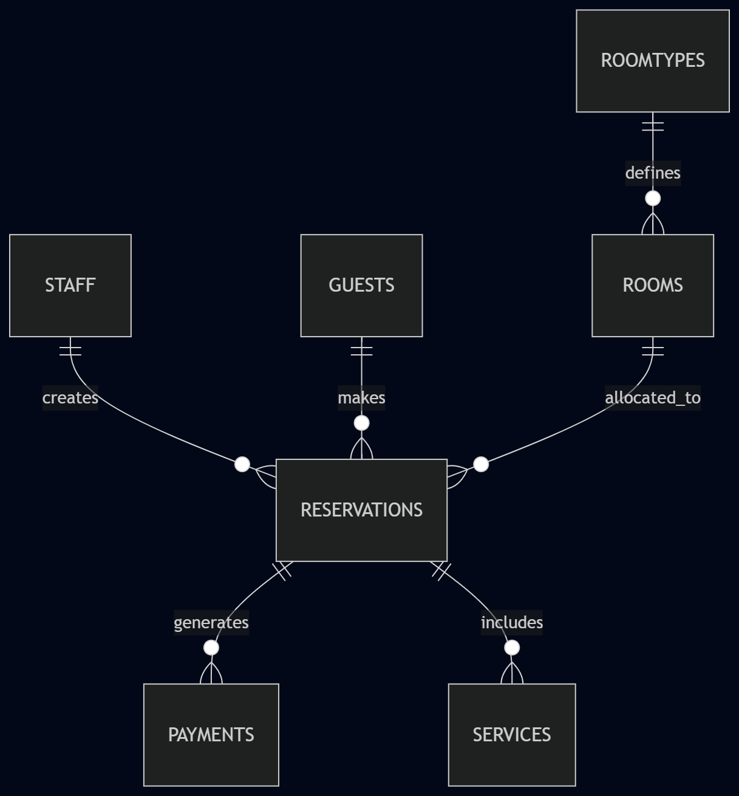

LUNA HOTEL VT

Bu çalışma konaklama sektöründeki süreçlerin yönetilmesi amacıyla tasarlanmış hayali bir veritabanı projesidir. Proje içeriğindeki tüm veriler simülasyon amaçlı üretilmiştir ve gerçek bir kurumu temsil etmemektedir. Çalışma T-SQL kullanılarak geliştirilmiştir.

Sistem mimarisi oda yönetimi, misafir kayıtları, rezervasyon, ödeme ve ek hizmet süreçlerini içeren ilişkisel bir yapıdan oluşmaktadır. Veritabanı tasarımı veri tutarlılığını sağlamak amacıyla normalize edilmiş ve anahtar ilişkileriyle yapılandırılmıştır.

Dosyaların uygulama sırası şöyledir:

1. LunaDDLKodları.sql tablo yapılarının ve kısıtlamaların oluşturulması.
2. LunaDMLKodları.sql simülasyon verilerinin aktarılması.
3. LunaVTSorgular.sql raporlama sorgularının çalıştırılması.

İletişim: Özgür Özkol - Akdeniz Üniversitesi Yönetim Bilişim Sistemleri Bölümü
E-posta: oozkol1@gmail.com
